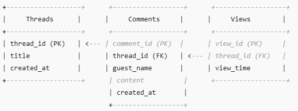
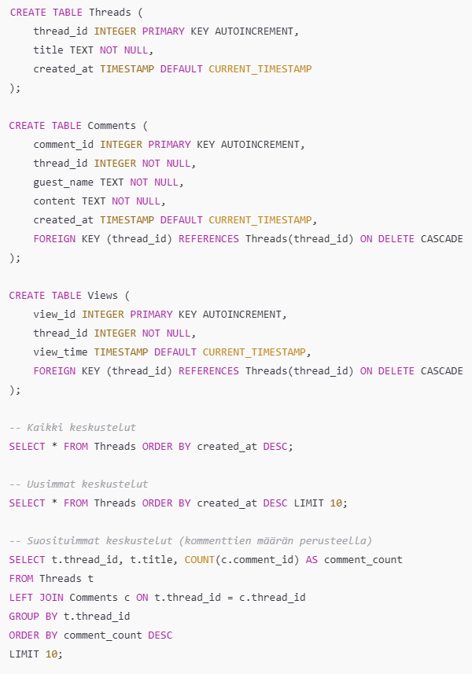

# Vaihe 1 

## Nettisivut loppuprojektina Web-kehittämisen jatkokurssilla

Tässä projektissa luon nettisivut hyödyntäen Käyttöliittymät ja käytettävyys -kurssissa mallintamaani sovellusta. Sovellus oli lukupiiri-sovellus. Tästä sovelluksesta hyödynnän tässä työssä ulkoasua ja osittain ideaa. Luon tässä projektissa keskustelupalsta-nettisivut, joka on tarkoitettu fantasiakirjallisuudesta keskustelemiseen. Käyttäjät voivat kommentoida ja luoda keskusteluja sivustolla. Keskusteluja on mahdollista selata "uusimmat", "suosituimmat" ja "kaikki keskustelut" osioiden avulla.

Projektintyöhön kuuluen, tämä suunnitelma voi muuttua projektin edetessä, mikäli muutokset tarpeen jonkin osa-alueen osalta. 

## Käyttäjäpersoonat

### Jenna
- 24 vuotta
- Työskentelee markkinoinnin parissa
- Harrastaa lukemista ja leipomista
- Haluaa jakaa kokemuksiaan lukemistaan kirjoista muiden kanssa, mutta lähipiirissä ei muita lukuintoilijoita

### Sara
- 28 vuotta
- Graafinen suunnittelija
- Rakastaa lukemista, erityisesti fantasiakirjallisuutta
- Etsii yhteisöä, jossa voi keskustella romaaneista 
- Arvostaa esteettistä, visuaalisesti miellyttäviä sivustoja

### Tomi 
- 45 vuotta
- Opettaja
- Nauttii fiktiokirjallisuudesta, erityisesti historiallisesta fantasiasta
- Arvostaa syvällisiä keskusteluja, kirja-arvosteluja ja suosituksia

## Käyttötapaukset ja -tilanteet

### Käyttötapaukset

####  **1. Keskusteluun osallistuminen**
 

**Käyttäjä:** Verkkosivuston käyttäjä  
**Tavoite:** Fantasiakirjallisuuteen liittyvään keskusteluun osallistuminen 
**Laukaisija:** Lukuharrastus   
**Käyttötapauksen kulku:**
1. Käyttäjä selaa sivustolla olevia keskusteluja
2. Käyttäjä valitsee haluamansa keskustelun 
3. Käyttäjä lukee muiden käyttäjien kommentteja
4. Käyttäjä kommentoi keskustelupalstalle

 

#### **2. Keskustelun aloittaminen** 
 

**Käyttäjä:** Verkkosivun käyttäjä  
**Tavoite:**  Keskustelun aloittaminen fantasiakirjallisuudesta  
**Laukaisija:** Lukuharrastus   
**Käyttötapauksen kulku:**
1. Käyttäjä siirtyy tekemään uuden keskustelun
2. Käyttäjä kirjoittaa keskustelun aiheen
3. Käyttäjä kirjoittaa keskusteluun ensimmäisen kommentin
4. Käyttäjä julkaisee uuden keskustelun

 

### Käyttötilanteet

#### OSALLISTUMINEN KESKUSTELUUN KOMMENTOIMALLA

**User story:** "Lumouksen lukijat -sivuston käyttäjänä haluan, että pystyn selaamaan sivustolla olevia keskusteluja ja kommentoimaan niitä, jotta voin osallistua käytyyn keskusteluun."
 

**Acceptance criteria:** 
- Käyttäjä pääsee sivustolle
- Käyttäjä näkee aloitetut keskustelut sivustolla ja voi selata niitä
- Käyttäjä näkee muiden käyttäjien kommentit
- Käyttäjä voi komentoida keskusteluihin
- Sivusto tallentaa kommentin oikeaan keskusteluun ja oikeaan järjestykseen
  

#### KESKUSTELUN ALOITTAMINEN

**User story:** "Lumouksen lukijat -sivuston käyttäjänä haluan, että pystyn aloittamaan keskusteluja minua kiinnostavista aiheista fantasiakirjallisuuteen liittyen, jotta voin jakaa kokemuksiani muiden kanssa."
 

**Acceptance criteria:** 
- Käyttäjä pääsee sivustolle
- Käyttäjä näkee aloita keskustelu -osion
- Käyttäjä voi valita keskustelulle aiheen ja lisätä ensimmäisen kommentin
- Käyttäjä voi lisätä keskustelun keskustelupalstalle
- Sivusto tallentaa uuden keskustelun ja asettaa sen sivustolle näkyville 
  

## Käyttöliittymän prototyyppi

Käyttöliittymän prototyypin olen mallintanut Figmassa hyödyntäen osin Käyttöliittymät ja käytettävyys -kurssille mallintamaani protoa. Tässä linkki Lumouksen lukijoiden sivuston protoon: 

https://www.figma.com/proto/kbhPlCEbCQhmUgvMvTKp0X/Keskustelu?node-id=1-52&p=f&t=1O75mPhXxCazCOS8-1&scaling=min-zoom&content-scaling=fixed&page-id=0%3A1&starting-point-node-id=1%3A52

## Tietoarkkitehtuuri ja tekninen suunnittelu

### Tietoarkkitehtuuri 

**Keskeiset tietomallit ja tietokanta**  
Sivuston tietokantana toimii SQLite-pohjainen relaatiotietokanta. SQLite valikoitui tietokannan pohjaksi, sillä se sopii pienen mittakaavan projekteihin. 

ChatGPT:n kanssa käydyn keskustelun perusteella esittelen tietomalleja ja tietokantaa ER (Entity-Relationship) -kaaavioiden avulla seuraavasti:

ENTITEETI JA RELAATIOT 

Selitys relaatioille: 
Threads (Keskustelut)
- Tallentaa keskustelut (otsikko, luontiaika).
- Jokainen keskustelu voi sisältää useita kommentteja.

Comments (Kommentit)
- Tallentaa anonyymien käyttäjien kommentit.
- Jokainen kommentti liittyy tiettyyn keskusteluun (thread_id FK).
- guest_name tallennetaan anonyymille kommentoijalle.

Views (Näyttökerrat)
- Tallentaa keskustelujen katselumäärät.
- Jokainen näyttökerta liittyy tiettyyn keskusteluun (thread_id FK).
- Tämä mahdollistaa keskustelujen järjestämisen uusimmat ja suosituimmat -osioihin.
 

SQL-MALLIT: 

Alla on tietokannan rakenteen SQL-mallit, jotka määrittävät keskustelupalstan keskeiset tietorakenteet. 

Taulujen selitykset: 
Threads (Keskustelut)
- Tallentaa keskustelut, joita käyttäjät aloittavat.
- thread_id: Automaattisesti kasvava yksilöllinen tunniste jokaiselle keskustelulle.
- title: Keskustelun otsikko.
- created_at: Keskustelun luomisaika, tallentuu automaattisesti.

Comments (Kommentit)
- Tallentaa keskusteluihin lisätyt kommentit.
- comment_id: Automaattisesti kasvava yksilöllinen tunniste jokaiselle kommentille.
- thread_id: Viittaa keskusteluun, johon kommentti kuuluu.
- guest_name: Käyttäjän itse antama nimimerkki.
- content: Kommentin sisältö.
- created_at: Kommentin luomisaika, tallentuu automaattisesti.
- FOREIGN KEY (thread_id): Jos keskustelu poistetaan, siihen liittyvät kommentit poistuvat myös.

Views (Näyttökerrat)
- Tallentaa, milloin keskusteluja katsotaan.
- view_id: Automaattisesti kasvava yksilöllinen tunniste jokaiselle katselukerralle.
- thread_id: Viittaa keskusteluun, jota katsottiin.
- view_time: Tallentaa katseluhetken automaattisesti.
- FOREIGN KEY (thread_id): Yhteys keskustelutauluun.
 

Tietokantakyselyjen selitykset:
-       Kaikki keskustelut: Näyttää kaikki keskustelut uusimmasta vanhimpaan.
-       Uusimmat keskustelut: Listaa 10 uusinta keskustelua.
-       Suosituimmat keskustelut: Näyttää keskustelut, joissa on eniten kommentteja, järjestettynä suosion mukaan.

### Tekninen suunnittelu

**Front-endin** toteutuksessa käytän projektissani seuraavia teknologioita: 
- HTML/CSS
- JavaScript
- React
- Bootstrap (mahdollisesti)

**Back-endin** toteutuksessa käytän projektissani seuraavia teknologioita:
- Node.js + Express

**Tietokannan** toteutuksessa käytän projektissani seuraavia teknologioita:
- SQLite

**Isännoinnin** toteutuksessa käytän projektissani seuraavia teknologioita:
- Azure App Service

## Projektinhallinta ja testaus

### Projektinhallinta

Projektin tavoite:   
Tavoitteena on luoda fantasiakirjallisuudesta kiinnostuneille käyttäjille keskustelupalsta, jonne käyttäjät voivat kommentoida ja aloittaa keskusteluja. Nettisivuilla on mahdollisuus selata avattuja keskusteluja suosituimmat -, uusimmat - ja kaikki -kategorioiden mukaan. Kesksutelupalstan tarkoitus on tarjota alusta fantasiakirjallisuusharrastajille, jossa voi jakaa tietoa, mielipiteitä ja ajatuksia kirjallisuudesta. 

Projektin rajaus:  
Projektissa luodaan toimivat verkkosivut, joissa toimintoina keskustelujen selaus, kommentointi ja keskustelujen avaus. 

Kustannukset:  
Projekti tehdään osana Web-kehittämisen jatkokurssia, jonka opintopistemäärä on 5 op. Projektin osuus kurssista on n. puolet eli 2,5 op eli projektiin varataan n. 68 h työtunteja. Projektin Vaihe 1:een kuluu työtunteja n. 15 % käytettävistä työtunneista. 45 % työtunneista jakautuu projektin Vaihe 2 tekemiseen, projektipajoihin osallistumiseen ja projektin esittelyyn. Kustannuksia projektissa voi muodostua Azure App Service:n käytöstä, arviolta alle 10 e. 

Riskianalyysi:  

Tapahtuman todennäköisyys
1. Epätodennäköinen
2. Mahdollinen
3. Todennäköinen

Seurausten vakavuus: 
1. Vähäiset
2. Haitalliset
3. Vakavat

|Nimi| Kuvaus| Todennäköisyys | Vaikutus |
|---|---|---|---|
|Sairastuminen |Projektin tekijän merkittävä sairastuminen | 1 | 3 |
|Resurssien puute | Tarvittavia resursseja ei ole | 2 | 2 |
|Tekninen häiriö | Esiintyy tekninen häiriö | 3 | 1 |
|Viivästyminen | Projektin valmistuminen viivästyy | 2 | 1 |
 

Laadunhallinta:  
Projektissa laadunhallintaa toteutetaan tarkastelemalla sivustolle asetettuja vaatimuksia ja ominaisuuksia niiden tärkeysasteen mukaan. Projektin laadunhallinnassa oleellisessa osassa on myös opettajanohjaus projektin eri vaiheissa. Laadunhallintaa tukee hyvin suunniteltu ja toteutettu käyttäjätestaus (lue alta Käyttäjä- ja sovellustestaus). 

Muutosten hallinta:  
Projektissa versionhallinta toteutetaan GitHub:n avulla, jonne tallennetaan verisopäivityksiä projektin eri vaiheissa. Muutosten tarvetta verkkosivuille kartoitetaan opettajan ohjauksessa palautteen muodossa tai työpajoissa. Projektin toteutumista dokumentoidaan alusta loppuun sekä seurataan käytettyä työmäärää. 

### Käyttäjätestaus ja sovellustestaus 

Projektin aikana testausta tapahtuu jatkuvana osana prosessia, kun kokeillaan eri vaihdeiden toimivuus nettisivuilla. Tämä siis tapahtuu manuaalisena testauksena projektin aikana projektin tekijän toimesta. 

**Käyttäjätestaussuunintelma:**

Moderoitu käytettävyystesti - Face-to-Face

Tavoite: Testissä tutkitaan sitä, onnistuuko käyttäjä tekemään alla listatut toiminnot annetun ohjeistuksen jälkeen. 

Toiminnot:
- kommentointi
- keskustelun aloittaminen
- suosittujen keskustelujen selaaminen
- uusimpien keskustelujen selaaminen
- kaikkien keskustelujen selaaminen

Ohejeistus: "Tässä on suunnittelemani nettisivut Lumouksen lukijat. Tämä on keskustelupalsta, jossa fantasiakirjallisuuden harrastajat voivat keskustella. Voit lisätä kommentteja, aloittaa keskusteluja sekä selata keskusteluja. Tutki nettisivuja vapaasti."

Testitilanne: Testattavalle annetaan ohjeistus. Testaaja seuraa testattavan toimintaa havainnoimalla ja tekee muistiinpanoja. Lopuksi testaaja kysyy loppuhaastattelukysymykset.

Loppukysymykset:
- Löysitkö toiminnallisuudet helposti?
- Mikä toimi sinusta hyvin?
- Onko kehittämisehdotuksia?

**Sovellustestaussuunnitelma:**  

1. Yksikkötestaus (Unit testing)

Tavoite: Yksikkötestauksen tavoitteena on varmistaa, että sovelluksen pienimmät yksiköt, kuten funktiot ja komponentit, toimivat oikein erillään muista osista.  

Testattavat osat:
-  Apufunktiot (utility functions)
-       Esim. suosituimpien keskustelujen laskenta
- React-komponentit
-       Keskustelulistan ja kommenttien renderöityminen
-       Käyttöliittymän interaktiot (napit, lomakkeet)

- API-kutsut ja tietojen käsittely
-       JSON-datan muokkaus ja käsittely ennen näyttämistä

Teknologiat:
- Testikirjasto: Jest / Vitest (jos käytössä Vite)
- React-komponenttien testaukseen: React Testing Library

2. End-to-End (E2E) -testaus

Tavoite: E2E-testauksen tavoitteena on varmistaa, että sovellus toimii kokonaisuutena käyttäjän näkökulmasta.  

Testattavat käyttötapaukset:
- Käyttäjä voi luoda uuden keskustelun
- Käyttäjä voi selata keskusteluja
- Käyttäjä voi lisätä kommentin keskusteluun

Teknologiat

- Testikirjasto: Playwright
- Selain: Chromium (tai muu Playwrightin tukema selain)

